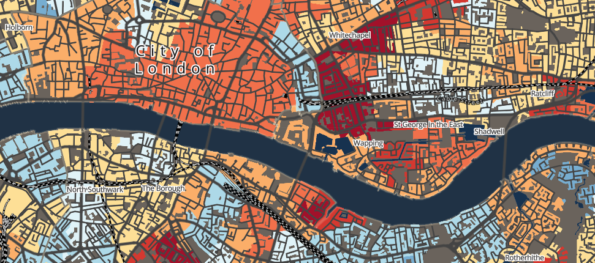

# Methods in Human Geography {.unnumbered}

```{r} 
#| label: 00-welcome
#| echo: False
#| cache: True
#| out.width: "100%"
 
```

## Welcome {.unnumbered}
Welcome to the second half of **Methods in Human Geography**. In this part of the module, you will delve into essential statistical analysis techniques and gain a basic foundation in working with spatial data. We wil be utilising R and the RStudio environment for statistical analysis, and the open-source programme QGIS for handling spatial data.

## Moodle {.unnumbered}
[Moodle](https://moodle.ucl.ac.uk/) is the central point of contact for GEOG0018 and it is where all important information will be communicated such as key module and assessment information. This workbook contains links to all reading material as well as the contents for all computer tutorials.

## Module overview {.unnumbered}
The topics covered over the next five weeks are:

| Week | Section  | Topic |
| :--- |:---------|:------------------ |
| 1    | Getting Started               | [R for Data Analysis]() |
| 2    | Statistical Analysis          | [Statistical Analysis I]() | 
| 3    | Statistical Analysis          | [Statistical Analysis II]() | 
| 4    | Spatial Analysis              | [Spatial Analysis I]() |
| 5    | Spatial Analysis              | [Spatial Analysis II]() |

## Acknowledgements {.unnumbered}
This year's workbook is compiled using:

- The [GEOG0030: Geocomputation 2023-2024](https://jtvandijk.github.io/GEOG0030_20232024/) workbook by [Justin van Dijk](https://www.mappingdutchman.com)
- Previous [GEOG018: Methods in Human Geography](https://www.ucl.ac.uk/module-catalogue/modules/methods-in-human-geography-GEOG0018) content created by [Rory Coulter](https://www.ucl.ac.uk/geography/rory-coulter)

The datasets used in this workbook contain:

- Data from Office for National Statistics licensed under the Open Government Licence v.3.0
- OS data © Crown copyright and database right [2024]