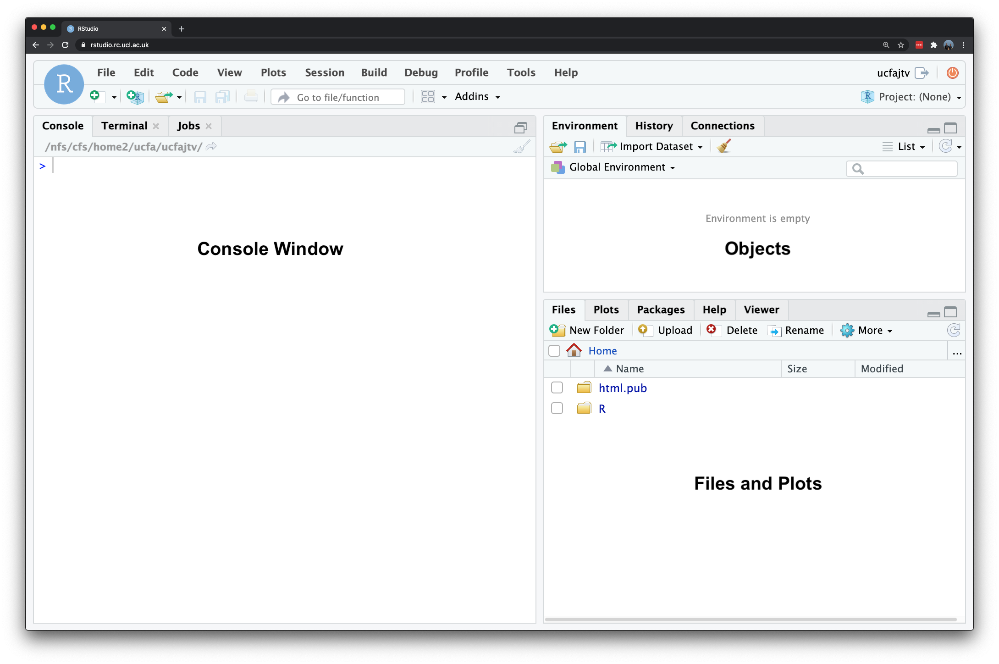

# R for Data Analysis
This week, we will start easy with a refresher on how to use R and RStudio for working with quantitative data. Building on last year's material, we will revisit key concepts but from next week we will takes these further by applying more advanced techniques. 

## Lecture slides
You can download the slides of this week's lecture here: [[Link]]().

## Reading list 
#### Essential readings 
- Brundson, C. and Comber, A. 2020. Opening practice: Supporting reproducibility and critical spatial data science. *Journal of Geographical Systems* 23: 477–496. [[Link]](https://doi.org/10.1007/s10109-020-00334-2)
- Franklin, R. 2023. Quantitative methods III: Strength in numbers? *Progress in Human Geography*. Online First. [[Link]](https://doi.org/10.1177/03091325231210512).

#### Suggested readings
- Field, A. Discovering Statistics using R, **Chapter 1**: *Why is my evil lecturer forcing me to learn statistics?*, pp. 1-31. [[Link]](https://read.kortext.com/reader/epub/2039249?page=1)
- Miller, H. and Goodchild, M. 2015. Data-driven geography. *GeoJournal* 80: 449–461. [[Link]](https://doi.org/10.1007/s10708-014-9602-6)
- Hadley, W. 2017. R for Data Science. **Chapter 3**: *Workflow: basics*. [[Link]](https://r4ds.hadley.nz/workflow-basics)

## Installation of R
R is a programming language originally designed for conducting statistical analysis and creating graphics. The major advantage of using R is that it can be used on any computer operating system, and is free for anyone to use and contribute to. Because of this, it has rapidly become the statistical language of choice for many academics and has a large user community with people constantly contributing new packages to carry out all manner of statistical, graphical, and importantly for us, geographical tasks.

Installing R takes a few relatively simple steps involving two pieces of software. First there is the R programme itself. Follow these steps to get it installed on your computer:

1.  Navigate in your browser to the download page: [[Link]](https://cran.r-project.org/)
2.  If you use a Windows computer, click on *Download R for Windows*. Then click on *base*. Download and install **R 4.4.x for Windows**. If you use a Mac computer, click on *Download R for macOS* and download and install **R-4.4.x.arm64.pkg** for [Apple silicon Macs](https://support.apple.com/en-gb/HT211814) or **R-4.4.x.x86_64.pkg** for older [Intel-based Macs](https://support.apple.com/en-gb/HT211814).

That is it! You now have successfully installed R onto your computer. To make working with the R language a little bit easier we also need to install something called an [Integrated Development Environment (IDE)](https://en.wikipedia.org/wiki/Integrated_development_environment). We will use [RStudio Desktop](https://posit.co/download/rstudio-desktop/):

1.  Navigate to the official webpage of RStudio: [[Link]](https://posit.co/download/rstudio-desktop/#download)
2.  Download and install RStudio on your computer.

::: {.callout-tip}
In case you do not have access to a laptop or encounter issues with the installation process, RStudio is also available through [Desktop@UCL Anywhere](https://www.ucl.ac.uk/isd/services/computers/remote-access/desktopucl-anywhere) as well as that it can be accessed on UCL computers across campus.
:::

After this, start **RStudio** to see if the installation was successful. Your screen should look something like what is shown in @fig-rstudio-interface.

```{r}
#| label: 01-maxprint
#| echo: False
#| eval: True
options(max.print=50)
``` 

```{r}
#| label: fig-rstudio-interface
#| echo: False
#| cache: True
#| fig-cap: "The RStudio interface."

```

The main windows that we will be using are:

| Window        | Purpose                                                             |
|:---------------|:-------------------------------------------------------|
| *Console*     | Where we write one-off code such as installing packages.            |
| *Files*       | Where we can see where our files are stored on our computer system. |
| *Environment* | Where our variables or objects are kept in memory.                  |
| *Plots*       | Where the outputs of our graphs, charts and maps are shown.         |

## Customisation of R
Now we have installed R and RStudio, we need to customise R. Many useful R functions come in packages, these are free libraries of code written and made available by other R users. This includes packages specifically developed for data cleaning, data wrangling, visualisation, mapping, and spatial analysis. To save us some time, we will install the R packages that we will need during the module in one go. 

Start RStudio, and copy and paste the following code into the **console** window. You can execute the code by pressing the **Return** button on your keyboard. Depending on your computer's specifications and the internet connection, this may take a short while.

```{r}
#| label: 01-install-libaries
#| echo: True
#| warnings: True
#| message: True
#| eval: False
#| tidy: True
#| filename: "R code"
# install packages
install.packages(c('tidyverse', 'janitor','stargazer'))
```

::: callout-warning
R libraries installed through [CRAN](https://cran.r-project.org/) are typically pre-compiled, meaning that these packages can be easily installed on your machine without additional steps. However, when attempting to install an R library that requires [compilation](https://en.wikipedia.org/wiki/Compiler), additional software must be installed. For Windows users, it is essential to install [RTools](https://cran.r-project.org/), which provides the necessary tools for building R packages from source. MacOS users should install [Xcode](https://mac.r-project.org/tools/) as well as the [GNU Fortran compiler](https://mac.r-project.org/tools/).
:::

Once you have installed the packages, we need to check whether we can in fact load them into R. Copy and paste the following code into the **console**, and execute by pressing **Return** on your keyboard again.

```{r}
#| label: 01-load-libaries
#| echo: True
#| warnings: True
#| message: True
#| eval: False
#| verbose: True
#| tidy: True
#| filename: "R code"
# load packages
library(tidyverse)
library(janitor)
library(stargazer)
```

You will see some information printed to your console but as long as you do not get any of the messages below, the installation was successful. If you do get any of the messages below it means that the package was not properly installed, so try to install the package in question again.

-   `Error: package or namespace load failed for <packagename>`
-   `Error: package '<packagename>' could not be loaded`
-   `Error in library(<packagename>) : there is no package called '<packagename>'`

::: {.callout-note}
Many packages require additional software components, known as *dependencies*, to function properly. Occasionally, when you install a package, some of these dependencies are not installed automatically. When you then try to load a package, you might encounter error messages that relate to a package that you did not explicitly loaded or installed. If this is the case, it is likely due to a missing dependency. To resolve this, identify the missing dependency and install it using the command `install.packages('<dependencyname>')`. Afterwards, try loading your packages again.
:::

## Getting started with R
Unlike traditional statistical analysis software like [Microsoft Excel](https://www.microsoft.com/en-us/microsoft-365/excel) or [IBM SPSS Statistics](https://www.ibm.com/products/spss-statistics), which often rely on point-and-click interfaces, R requires users to input commands to perform tasks such as loading datasets and fitting models. This command-based approach is typically done by writing scripts, which not only document your workflow but also allow for easy repetition of tasks.

Let us begin by exploring some of R's built-in functionality through a simple exercise: creating a few variables and performing basic mathematical operations.

::: {.callout-tip}
In your RStudio console, you will notice a prompt sign `>` on the left-hand side. This is where you can directly interact with R. If any text appears in red, it indicates an error or warning. When you see the `>`, it means R is ready for your next command. However, if you see a `+`, it means you have not completed the previous line of code. This often happens when brackets are left open or a command is not properly finished as R expected.
:::

At its core, every programming language can be used as a powerful calculator. Type in `10 * 12` into the console and execute.

```{r}
#| label: 01-math1
#| classes: styled-output
#| echo: True
#| eval: True
#| tidy: True
#| filename: "R code"
# multiplication
10 * 12
```

Once you press return, you should see the answer of `120` returned below.

### Storing variables
Instead of using raw numbers or standalone values, it is more effective to store these values in variables, which allows for easy reference later. In R, this process is known as **creating an object**, and the object is stored as a variable. To assign a value to a variable, use the `<-` syntax. Let us create two variables to experiment with this

Type in `ten <- 10` into the console and execute.

```{r}
#| label: 01-math2
#| classes: styled-output
#| echo: True
#| eval: True
#| tidy: True
#| filename: "R code"
# store a variable
ten <- 10
```

You will see nothing is returned in the console. However, if you check your **environment** window, you will see that a new variable has appeared, containing the value you assigned.

Type in `twelve <- 12` into the console and execute.

```{r}
#| label: 01-math3
#| classes: styled-output
#| echo: True
#| eval: True
#| tidy: True
#| filename: "R code"
# store a variable
twelve <- 12
```

Again, nothing will be returned to the console, but be sure to check your environment window for the newly created variable. We have now stored two numbers in our environment and assigned them variable names for easy reference. R stores these objects as variables in your computer's [RAM memory](https://en.wikipedia.org/wiki/Random-access_memory), allowing for quick processing. Keep in mind that without saving your environment, these variables will be lost when you close R and you would need to run your code again. 

Now that we have our variables, let us proceed with a simple multiplication. Type in `ten * twelve` into the console and execute.

```{r}
#| label: 01-math4
#| classes: styled-output
#| echo: True
#| eval: True
#| tidy: True
#| filename: "R code"
# using variables
ten * twelve
```

You should see the output in the console of `120`. While this calculation may seem trivial, it demonstrates a powerful concept: these variables can be treated just like the values they contain.

Next, type in `ten * twelve * 8` into the console and execute.

```{r}
#| label: 01-math5
#| classes: styled-output
#| echo: True
#| eval: True
#| tidy: True
#| filename: "R code"
# using variables and values
ten * twelve * 8
```

You should get an answer of `960`. As you can see, we can mix variables with raw values without any problems. We can also store the output of variable calculations as a new variable.

Type `output <- ten * twelve * 8` into the console and execute.

```{r}
#| label: 01-math6
#| classes: styled-output
#| echo: True
#| eval: True
#| tidy: True
#| filename: "R code"
# store output 
output <- ten * twelve * 8
```

Because we are storing the output of our calculation to a new variable, the answer is not returned to the screen but is kept in memory.

### Accessing variables
We can ask R to return the value of the `output` variable by simply typing its name into the console. You should see that it returns the same value as the earlier calculation.

```{r}
#| label: 01-math7
#| classes: styled-output
#| echo: True
#| eval: True
#| tidy: True
#| filename: "R code"
# return value 
output
```

### Text variables
We can also store variables of different data types, not just numbers but text as well.

Type in `str_variable <- "Hello GEOG0018"` into the console and execute.

```{r}
#| label: 01-str1
#| classes: styled-output
#| echo: True
#| eval: True
#| tidy: True
#| filename: "R code"
# store a variable
str_variable <- 'Hello GEOG0018'
```

We have just stored our sentence made from a combination of characters. A variable that stores text is known as a string or character variable. These variables are always denoted by the use of single (`''`) or double (`""`) quotation marks.

Type in `str_variable` into the console and execute.

```{r}
#| label: 01-str2
#| classes: styled-output
#| echo: True
#| eval: True
#| tidy: True
#| filename: "R code"
# return variable
str_variable
```

You should see our entire sentence returned, enclosed in quotation marks (`""`).

### Calling functions
We can call functions on our variable. For example, we can ask R to **print** our variable, which will give us the same output as accessing it directly via the console.

Type in `print(str_variable)` into the console and execute.

```{r}
#| label: 01-str3
#| classes: styled-output
#| echo: True
#| eval: True
#| tidy: True
#| filename: "R code"
# printing a variable
print(str_variable)
```

::: {.callout-tip}
You can type `?print` into the console to learn more about the `print()` function. This method works with any function, giving you access to its documentation. Understanding this documentation is crucial for using the function correctly and interpreting its output.
::: 

```{r}
#| label: 01-str4
#| classes: styled-output
#| echo: True
#| eval: False
#| tidy: False
#| filename: "R code"
# open documentation of the print function
?print
```

::: {.callout-note}
In many cases, a function will take more than one argument or parameter, so it is important to know what you need to provide the function with in order for it to work. For now, we are using functions that only need one *required* argument although most functions will also have several *optional* or *default* parameters.
:::

### Inspecting variables
Within the base R language, there are various functions that have been written to help us examine and find out information about our variables. For example, we can use the `typeof()` function to check what data type our variable is.

Type in `typeof(str_variable)` into the console and execute.

```{r}
#| label: 01-str5
#| classes: styled-output
#| echo: True
#| eval: True
#| tidy: True
#| filename: "R code"
# call the typeof() function
typeof(str_variable)
```

You should see the answer: `character`. As evident, our `str_variable` is a `character` data type. We can try testing this out on one of our earlier variables too.

Type in `typeof(ten)` into the console and execute.

```{r}
#| label: 01-str6
#| classes: styled-output
#| echo: True
#| eval: True
#| tidy: True
#| filename: "R code"
# call the typeof() function 
typeof(ten)
```

You should see the answer: `double`. Alternatively, we can check the `class` of a variable by using the `class()` function.

Type in `class(str_variable)` into the console and execute.

```{r}
#| label: 01-str7
#| classes: styled-output
#| echo: True
#| eval: True
#| tidy: True
#| filename: "R code"
# call the class() function 
class(str_variable)
```

In this case, you will see the same result as before because, in R, both the `class` and `type` of a `string` are `character`. Other programming languages might use the term `string` instead, but it essentially means the same thing.

Type in `class(ten)` into the console and execute.

```{r}
#| label: 01-str8
#| classes: styled-output
#| echo: True
#| eval: True
#| tidy: True
#| filename: "R code"
# call the class() function 
class(ten)
```

In this case, you will get a different result because the `class` of this variable is `numeric`. Numeric objects in R can be either `doubles` (decimals) or `integers` (whole numbers). You can test whether the `ten` variable is an integer by using specific functions designed for this purpose.

Type in `is.integer(ten)` into the console and execute.

```{r}
#| label: 01-var1
#| classes: styled-output
#| echo: True
#| eval: True
#| tidy: True
#| filename: "R code"
# call the integer() function
is.integer(ten)
```

You should see the result `FALSE`. As we know from the `typeof()` function, the `ten` variable is stored as a `double`, so it cannot be an `integer`.

::: {.callout-note}
Whilst knowing how to distinguish between different data types might not seem important now, the difference betwee a `double` and an `integer` can quite easily lead to unexpected errors.
:::

We can also check the length of our a variable.

Type in `length(str_variable)` into the console and execute.

```{r}
#| label: 01-var2
#| classes: styled-output
#| echo: True
#| eval: True
#| tidy: True
#| filename: "R code"
# call the length() function 
length(str_variable)
```

You should get the answer `1` because we only have one *set* of characters.  We can also determine the length of each set of characters, which tells us the length of the string contained in the variable.

Type in `nchar(str_variable)` into the console and execute.

```{r}
#| label: 01-var3
#| classes: styled-output
#| echo: True
#| eval: True
#| tidy: True
#| filename: "R code"
# call the nchar() function
nchar(str_variable)
```

You should get an answer of `14`.

### Creating multi-value objects
Variables are not constricted to one value, but can be combined to create larger objects. Type in `two_str_variable <- c("This is our second variable", "It has two parts to it")` into the console and execute.

```{r}
#| label: 01-var4
#| classes: styled-output
#| echo: True
#| eval: True
#| tidy: True
#| filename: "R code"
# store a new variable 
two_str_variable <- c("This is our second string variable", "It has two parts to it")
```

In this code, we have created a new variable using the `c()` function, which combines values into a `vector` or `list`. We provided the `c()` function with two sets of strings, separated by a comma and enclosed within the function's parentheses.

Let us now try both our `length()` and `nchar()` on our new variable and see what the results are:

```{r}
#| label: 01-var5
#| classes: styled-output
#| echo: True
#| eval: True
#| tidy: True
#| filename: "R code"
# call the length() function 
length(two_str_variable)

# call the nchar() function
nchar(two_str_variable)
```

You should notice that the `length()` function now returned a `2` and the `nchar()` function returned two values of `34` and `22`.

::: {.callout-note}
You may have noticed that each line of code in the examples includes a comment explaining its purpose. In R, comments are created using the hash symbol `#`. This symbol instructs R to ignore the commented line when executing the code. Comments are useful for understanding your code when you revisit it later or when sharing it with others.
:::

Extending the concept of multi-value objects to two dimensions results in a `dataframe.` A dataframe is the *de facto* data structure for most tabular data. We will use functions from the `tidyverse` library, a suite of packages to load a data file and conduct exploratory data analysis. 

Within the `tidyverse`, `dataframes` are referred to as `tibbles.` Some of the most important and useful functions come from the `tidyr` and `dplyr` packages, including:

| Package   | Function          | Use to |
| :-        | :--               | :------ |
| `dplyr`	  | `select()`        | select columns |
| `dplyr`	  | `filter()`        | select rows |
| `dplyr`	  | `mutate()`        | transform or recode variables |
| `dplyr`	  | `summarise()`     | summarise data |
| `dplyr`	  | `group_by()`      | group data into subgroups for further processing |
| `tidyr`	  | `pivot_longer()`  | convert data from wide format to long format |
| `tidyr`	  | `pivot_wider()`   | convert long format dataset to wide format |

::: {.callout-tip}
For more information on the `tidyverse` you can refer to [www.tidyverse.org](https://www.tidyverse.org/).
:::

## Age groups in Camden
In RStudio, scripts allow us to build and save code that can be run repeatedly. We can organise these scripts into RStudio projects, which consolidate all files related to an analysis such as input data, R scripts, results, figures, and more. This organisation helps keep track of all data, input, and output, while enabling us to create standalone scripts for each part of our analysis. Additionally, it simplifies managing [directories and filepaths](https://en.wikipedia.org/wiki/Path_(computing)).

Navigate to **File** -> **New Project** -> **New Directory**, and create a folder with the name `GEOG0018`. Click on **Create Project**. You should now see your main window switch to this new project and when you check your **files** window, you should see a new **R Project** called `GEOG0018`.
  
::: {.callout-warning}
Please ensure that **folder names** and **file names** do not contain spaces or special characters such as `*` `.` `"` `/` `\` `[` `]` `:` `;` `|` `=` `,` `<` `?` `>` `&` `$` `#` `!` `'` `{` `}` `(` `)`. Different operating systems and programming languages deal differently with spaces and special characters and as such including these in your folder names and file names can cause many problems and unexpected errors. As an alternative to using white space you can use an underscore `_` or hyphen `-` if you like.
:::

With the basics covered, let us dive into loading a real dataset, perform some data cleaning, and conducting some exploratory data analysis on the distribution of age groups in Camden. The data covers all usual residents across London, as recorded in the 2021 Census for England and Wales, aggregated at the [Lower Super Output Area (LSOA)](https://www.ons.gov.uk/methodology/geography/ukgeographies/censusgeographies/census2021geographies) level.

::: {.callout-note}
An LSOA is a geographic unit used in the UK for statistical analysis. It typically represents small areas with populations of around 1,000 to 3,000 people and is designed to ensure consistent data reporting. LSOAs are commonly used to report on census data, deprivation indices, and other socio-economic statistics.
:::

The dataset has been extracted using the [Custom Dataset Tool](https://www.ons.gov.uk/datasets/create), and you can download the file via the link provided below. Save the files in your project folder under `data`.

::: {.callout-note}
You will have to create a folder named `data` inside your **R Project**.
:::

| File                                        | Type   | Link |
| :------                                     | :------| :------ |
| London LSOA Census 2021 Age Groups          | `csv` | [Download](https://github.com/jtvandijk/GEOG0018/tree/master/data/London-LSOA-AgeGroup.csv) |

::: {.callout-tip}
To download a `csv` file that is hosted on GitHub, click on the `Download raw file` button on the top right of your screen and it should download directly to your computer.
:::

To get started, let us create our first script. **File** -> **New File** -> **R Script**. Save your script as `w06-age-analysis.r`. 

We will start by loading the libraries that we will need:

```{r}
#| label: 01-load-libraries
#| classes: styled-output
#| echo: True
#| eval: True
#| output: False
#| tidy: True
#| filename: "R code"
# load libraries
library(tidyverse)
library(janitor)
```

::: {.callout-tip}
In RStudio, there are two primary ways to run a script: all at once or by executing individual lines or chunks of code. As a beginner, it is often beneficial to use the line-by-line approach, as it allows you to test your code interactively and catch errors early.

To run line-by-line:

- By clicking: Highlight the line or chunk of code you want to run, then go to **Code** and select **Run selected lines**.
- By key commands: Highlight the code, then press `Ctl` (or `Cmd` on Mac) + `Return`.

To run the whole script:

- By clicking:  In the scripting window, click **Run** in the top-right corner and choose **Run All**.
- By key commands: Press `Option` + `Ctrl` (or `Cmd`) + `R`.

If a script gets stuck or you realise there is an error in your code, you may need to interrupt R. To do this, go to **Session** -> **Interrupt R**. If the interruption doesn't work, you might need to terminate and restart R.
:::

### Data loading
Next, we can load the `London-LSOA-AgeGroup.csv` file into R. 

```{r}
#| label: 01-load-data
#| classes: styled-output
#| echo: True
#| eval: True
#| tidy: True
#| filename: "R code"
# load age data
lsoa_age <- read_csv('data/London-LSOA-AgeGroup.csv')
```

::: {.callout-warning}
If using a Windows machine, you may need to substitute your forward-slashes (`/`) with two backslashes (`\\`) whenever you are dealing with file paths.
:::

Let us have a look at the dataframe:

```{r}
#| label: 01-inspect-data
#| classes: styled-output
#| echo: True
#| eval: True
#| tidy: True
#| filename: "R code"
# inspect columns, rows
ncol(lsoa_age)
nrow(lsoa_age)

# inspect data
head(lsoa_age)

# inspect column names
names(lsoa_age)
```
::: {.callout-tip}
You can further inspect the results using the `View()` function. 
:::

To access specific columns or rows in a dataframe, we can use indexing. Indexing refers to the numbering assigned to each element within a data structure, allowing us to precisely select and manipulate data.

To access the first row of a dataframe, you would use `dataframe[1, ]`, and to access the first column, you would use `dataframe[, 1]`. The comma separates the row and column indices, with the absence of a number indicating all rows or columns respectively.

::: {.callout-warning}
In R, indexing begins at 1, meaning that the first element of any data structure is accessed with the index `[1]`. This is different from many other programming languages, such as Python or Java, where indexing typically starts at `0`. 
:::

```{r}
#| label: 01-index-data
#| classes: styled-output
#| echo: True
#| eval: True
#| tidy: True
#| filename: "R code"
# index columns
lsoa_age[ ,1]

# index rows
lsoa_age[1, ]

# index cell
lsoa_age[1,1]
```

::: {.callout-tip}
Alternatively, you can access the data within individual columns by referring to their names using the `$` operator. This allows you to easily extract and work with a specific column without needing to know its position in the dataframe. For example, if your dataframe is named `dataframe` and you want to access a column named `age`, you would use `dataframe$age`. This method is especially useful when your data has many columns or when the column positions may change, because it relies on the column names rather than their index numbers.
:::

Because all the data are stored in [long format](https://towardsdatascience.com/long-and-wide-formats-in-data-explained-e48d7c9a06cb), we need to transform the data to a [wide format](https://towardsdatascience.com/long-and-wide-formats-in-data-explained-e48d7c9a06cb). This means that instead of having multiple rows for an LSOA showing counts for different age groups, all the information for each LSOA will be consolidated into a single row. Additionally, we will clean up the column names to follow standard R naming conventions and make the data easier to work with. We can automate this process using the `janitor` package.

We can do this as follows:

```{r}
#| label: 01-reformat-data-age
#| classes: styled-output
#| echo: True
#| eval: True
#| tidy: True
#| filename: "R code"
# clean names 
lsoa_age <- lsoa_age |>
  clean_names()

# pivot wider
lsoa_age <- lsoa_age |>
  pivot_wider(id_cols = c('lower_layer_super_output_areas_code', 'lower_layer_super_output_areas'),
              names_from = 'age_5_categories',
              values_from = 'observation') 

# clean names
lsoa_age <- lsoa_age |>
  clean_names()
```

::: {.callout-note}
The code above uses a pipe function: `|>`. The pipe operator allows you to pass the output of one function directly into the next, streamlining your code. While it might be a bit confusing at first, you will find that it makes your code faster to write and easier to read. More importantly, it reduces the need to create multiple intermediate variables to store outputs.
:::

::: {.callout-tip}
You can inspect the results using the `View()` function. 
:::

### Data exploration
Now that we have loaded and inspected our data, we can begin by examining its distribution. Let us take a look at the number of people aged 16 to 24 across London. This data is stored in the `aged_16_to_24_years` column.

```{r}
#| label: 01-explore-data
#| classes: styled-output
#| echo: True
#| eval: True
#| tidy: True
#| filename: "R code"
# mean 
mean(lsoa_age$aged_16_to_24_years)

# median
median(lsoa_age$aged_16_to_24_years)

# range
range(lsoa_age$aged_16_to_24_years)

# summary
summary(lsoa_age$aged_16_to_24_years)
```

We can also call some functions to quickly draw a boxplot, histogram of frequencies, or, when combining different variables, a bivariate plot:

```{r}
#| label: fig-01-plot-data-boxplot
#| fig-cap: Quick boxplot.
#| classes: styled-output
#| echo: True
#| eval: True
#| tidy: True
#| filename: "R code"
# boxplot 
boxplot(lsoa_age$aged_16_to_24_years, horizontal = TRUE)
```

```{r}
#| label: fig-01-plot-data-histogram
#| fig-cap: Quick histogram.
#| classes: styled-output
#| echo: True
#| eval: True
#| tidy: True
#| filename: "R code"
# histogram
hist(lsoa_age$aged_16_to_24_years, breaks = 50, xlab = 'Number of LSOAs', main = 'Number of people aged between 16 and 24')
```


```{r}
#| label: fig-01-plot-data-bivariate
#| fig-cap: Quick bivariate plot.
#| classes: styled-output
#| echo: True
#| eval: True
#| tidy: True
#| filename: "R code"
# bivariate plot
plot(lsoa_age$aged_16_to_24_years, lsoa_age$aged_50_years_and_over, 
     xlab = 'Number of people aged between 16 and 24', ylab = 'Number of people aged 50 or over')
```

### Data filtering
So far we have only looked at the dataset for London as a whole. So, let us zoom in to Camden by filtering our dataset:

```{r}
#| label: 01-filter-data
#| classes: styled-output
#| echo: True
#| eval: True
#| tidy: True
#| filename: "R code"
# filter out camden
lsoa_age_camden <- lsoa_age |>
  filter(str_detect(lower_layer_super_output_areas, 'Camden'))

# inspect
head(lsoa_age_camden)
```

::: {.callout-tip}
The `str_detect()` function searches for a substring within a larger string and returns a logical value indicating whether the searched text is present. In turn, te `filter()` function uses this to subset the dataset.
:::

::: {.callout-tip}
You can further inspect the results using the `View()` function. 
:::

We can save this dataset so that we can easily load it the next time we want to work with this by writing it to a `csv` file.

```{r}
#| label: 01-write-csv
#| classes: styled-output
#| echo: True
#| eval: False
#| tidy: True
#| filename: "R code"
# write data
write_csv(x = lsoa_age_camden, file = 'data/Camden-LSOA-AgeGroup.csv')
```

## Homework task 
This concludes this week's tutorial. Now complete the following homework tasks:

1. Filter the London LSOAs to any of the [London boroughs](https://en.wikipedia.org/wiki/London_boroughs) other than Camden.
2. Create either a histogram or a boxplot showing the distribution of the number of people aged 25 to 34 years. Make sure to give your plot a clear title and label the axes appropriately for interpretation.

::: {.callout-warning}
Make sure to copy and paste the output of this week's homework task into the appendix of your assignment.  Additionally, include a few sentences interpreting the results.
:::

## Before you leave
This week, we revisited the basics of conducting quantitative analysis in R and RStudio, building on the material introduced last year in [Geography in the Field I](https://www.ucl.ac.uk/module-catalogue/modules/geography-in-the-field-1-GEOG0013) and [Geography in the Field II](https://www.ucl.ac.uk/module-catalogue/modules/geography-in-the-field-2-GEOG0014). Now that everyone is back up to speed, next week we will move on to using R for statistical analysis. But for now, it is [time to kick back and relax](https://www.youtube.com/watch?v=dmxJIc3M7LI)!